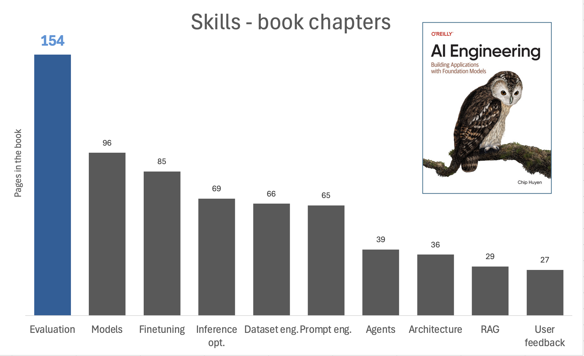

Title: Weight AI Eng skills by page count
Date: 2025-08-31 21:41
Status: published

I am currently reading "AI Engineering" by Chip Huyen and am really enjoying it. I spent some years as data scientist in the past, and now I found some analogies between data science and AI engineering. The analogy is in the way the industry is talking about the discipline and what actually engineering teams are fighting on daily. Before going into that, let's define how we can evaluate the importance of different skills in AI engineering.

> What AI engineering skill is actually the most important while being the skill less spoken about?

To do so, I will use a totally arbitrary method: weighting each skill by the number of pages it appears in the book. This is not a perfect metric, but it can give us some insights into which skills the author considers more important. So I drew the following chart based on the page count:

### Evaluation, evaluation, evaluation

I have been considering evaluation as **the skill** that differentiates a senior data scientist from a junior one likewise testing is the skill that differentiates a senior software engineer from a junior one. In the context of AI engineering, evaluation becomes even more crucial. Why is it so relevant? Taking some points from Huyen's book:

1. open ended outputs, for a given input, there are so many possible correct responses.
2. the more intelligent AI models become, the harder it is to evaluate them. You can no longer evaluate a response based on how it sounds.
3. black box models, no details such as the model architecture, training data, and the training process

<blockquote class="twitter-tweet">
evals are surprisingly often all you need
&mdash; Greg Brockman (@gdb) <a href="https://twitter.com/gdb/status/1733553161884127435?ref_src=twsrc%5Etfw">December 9, 2023</a></blockquote> 
