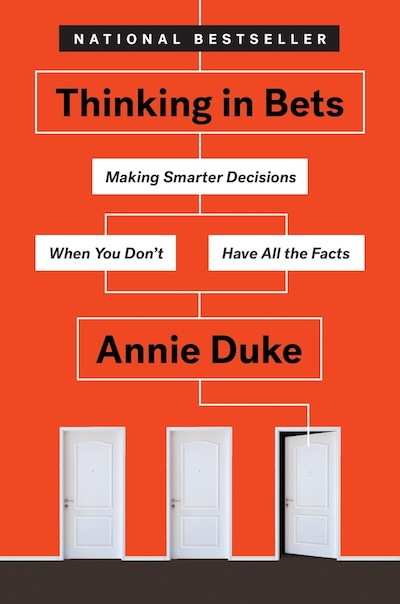

Title: Book review: thinking in bets
Date: 2025-08-24 13:41
Status: published

> “**Wanna bet?**” triggers us to engage in that third step that we only sometimes get to. Being asked if we are willing to bet money on it makes it much more likely that we will examine our information in a less biased way, be more honest with ourselves about how sure we are of our beliefs, and be more open to updating and calibrating our beliefs.

A couple of months ago, I read _Thinking in Bets_ by Annie Duke. The book presents a compelling case for decision-making under uncertainty and offers practical strategies for improving our thinking processes.

## Key Takeaways

One of the key takeaways from the book is the concept of "**resulting**," which is the tendency to judge the quality of a decision based on its outcome rather than the reasoning behind it. Duke argues that this mindset can lead to poor decision-making in the long run, as it encourages us to ignore valuable information and lessons learned from our experiences.

## My (conditioned) opinion on the book

Before reading _Thinking in Bets_ , I had the chance to read books like

- _Thinking, Fast and Slow_ by Daniel Kahneman
- _The Signal and the Noise_ by Nate Silver
- _The Black Swan_ by Nassim Nicholas Taleb

 While _Thinking in Bets_ offers valuable insights, most concepts reminded me of ideas presented in these other works. I think it serves as a useful primer for those new to the subject, but it may not offer enough depth for readers already familiar with these concepts.

## Other quotes I liked

> We are discouraged from saying “I don’t know” or “I’m not sure.” We regard those expressions as vague, unhelpful, and even evasive. But **getting comfortable with “I’m not sure”** is a vital step to being a better decision-maker. We have to make peace with not knowing.

> In most of our decisions, we are not betting against another person. Rather, we are betting against all the **future versions of ourselves** that we are not choosing. We are constantly deciding among alternative futures: one where we go to the movies, one where we go bowling, one where we stay home.

> People are credulous creatures who find it very easy to believe and very difficult to doubt. [actually citing Daniel Gilbert]

> Surprisingly, being smart can actually make bias worse. Let me give you a different intuitive frame: the smarter you are, the better you are at constructing a narrative that supports your beliefs, rationalizing and framing the data to fit your argument or point of view. After all, people in the “spin room” in a political setting are generally pretty smart for a reason.