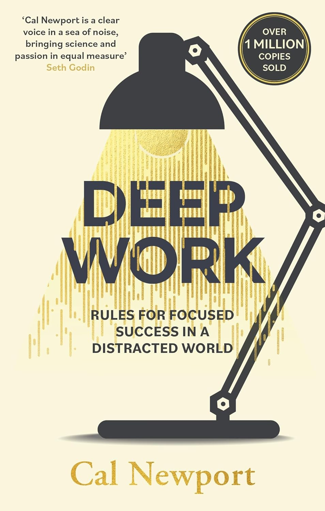
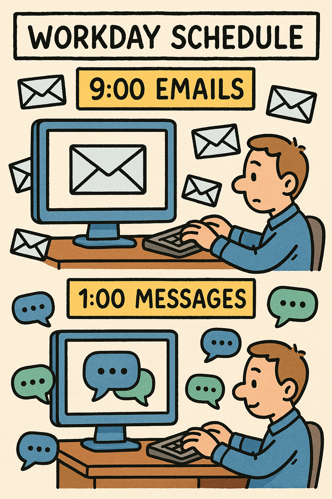

Title: Why reading Deep Work
Date: 2025-04-13 19:35
Slug: deep_work_book
Status: published

> Shallow Work: Noncognitively demanding, logistical-style tasks, often performed while distracted. These efforts tend not to create much new value in the world and are easy to replicate.

Cal Newport gives this definition of how I spend part of my work-time in his _Deep Work_ book. Checking emails, messaging on Teams, and attending meetings are few examples of such "noncognitively demanding" activities. On some days, these activities may even fill up my work-time. How much space is left for cognitively intensive task? When I have space for few consecutive hours of highly focused work, I have the feeling that what I'm doing is actually valuable.

**I'm not alone**. Talking with my peers, I understood that almost anyone is facing the same issue. Days being full of non focused and low demanding tasks. I'm part of what Newport defines "knowledge workers". The output of our work is not some physical manufact, neither a service that is directly customer-facing. The paradox is the following. Knowledge workers give their best when they have space for focus, however organizations adopt tools for instant communication that are designed to drain such attention.

## Deep Work Hypothesis

Is it de facto a problem? Or is it actually an **opportunity** for those who are aware of it? Here it comes the interesting point made by Newport. He defines the "Deep Work Hypothesis" as:

> The ability to perform deep work is becoming increasingly rare at exactly the same time it is becoming increasingly valuable in our economy. As a consequence, the few who cultivate this skill, and then make it the core of their working life, will thrive.

The claim is that we operate in a distracting work enviroment. At the same time, the job industry require continuous learning and high specialization. Both of these requirements need deep focus. Deep focus is today harder to achieve. People who can shield themselves from distractions and dedicate time to focused work are the ones who will thrive.

## Busyness

What are symptoms of lack of deep work in your daily job? If you consider yourself a knowledge-worker, spending most of time answering emails or instant-messaging are indicators that deep work is lacking. Why is it so common in most companies then? Newport introduces the _Principle of Least Resistance_.

> In a business setting, without clear feedback on the impact of various behaviors to the bottom line, we will tend toward behaviors that are **easiest in the moment**.

So, why do many workers (especially in large organizations) spend so much time in low-intensity activities (like emailing or chatting)? Becaust it is easy. This is the short answer by the _Principle of Least Resistance_. Answering emails or messages gives an immediate feedback to the worker, while long and focused activities likely lack such quick feedback. Our brain is tempted by such quick feedbacks. Resisting the quick feedback of going through email requires a greater effort.

This workday schedule has two drawbacks. First, continuous interruptions and context switch reduce the focus and attention. Low levels of cognitively intense activities reduce the value generated by such activities. Second, the worker is unhappy with the work he/she's doing. Newport cites a study by the psychologist Csikszentmihalyi. His studies demonstrated that, surprisingly, we are most satisfied when we're given difficult tasks to accomplish rather than when relaxing.

> The best moments usually occur when a person’s body or mind is stretched to its limits in a voluntary effort to accomplish something difficult and worthwhile.”

## Budget of willpower

We cannot just decide to concentrate and expect it to happen. It just does not work. We have a limited amount of willpower. It decreases when we use it. For simplicity, we can consider it as a daily budget of willpower. The key recommendation by Newport is the following. Build a set of routines and rituals that help you develop deep work habits. By doing so, you minimize the amount of willpower you need to use to focus. The less you willpower you use for each focuse session, the more you save for focusing on the rest of the day.

Newport describes four approaches to building such routines:

- monastic philosophy
- bimodal philosophy
- rithmic philosophy
- journalistic philosophy

I'll not go through describing each of them. You should read the book to get a full picture of them.

I'll share an example to help you get a taste of what it means to build your "philosophy" of routines. The books makes the example of the workday schedule of Charles Darwin (you can get more details [here](https://www.darwinproject.ac.uk/commentary/curious/darwin-and-working-home)).

> Charles Darwin had a similarly strict structure for his working life during the period when he was perfecting On the Origin of Species. As his son Francis later remembered, he would rise promptly at seven to take a short walk. He would then eat breakfast alone and retire to his study from eight to nine thirty. The next hour was dedicated to reading his letters from the day before, after which he would return to his study from ten thirty until noon. After this session, he would mull over challenging ideas while walking on a prescribed route that started at his greenhouse and then circled a path on his property. He would walk until satisfied with his thinking then declare his workday done.

## What I do

To cultivate the habit of deep work and improve my focus, I have set the following goals for myself:

1. **Focused Activities Early Morning or Weekends**  
    I aim to dedicate the early hours of my workdays or weekends to cognitively demanding tasks. These are the times when my mind is fresh, and distractions are minimal. By prioritizing deep work during these periods, I can make significant progress on challenging projects.

2. **Turn Off Popups and Notifications on Desktop**  
    To shield myself from distractions, I will disable all unnecessary popups and notifications on my desktop. This includes email alerts, instant messaging notifications, and other interruptions that can break my focus. Creating a distraction-free environment is essential for maintaining deep concentration.

3. **Emails in Late Afternoon or Evenings**  
    I will reserve time for checking and responding to emails in the late afternoon or evenings. This ensures that my most productive hours are not consumed by shallow work. By batching email tasks, I can handle them more efficiently without constant context switching.

4. **Take Notes During Meetings to Help Focus**  
    During meetings, I will take detailed notes to stay engaged and focused. This practice not only helps me retain important information but also prevents my mind from wandering. It ensures that I am fully present and can contribute meaningfully to discussions.

By adhering to these goals, I aim to build a sustainable routine that supports deep work and enhances the quality of my output.
