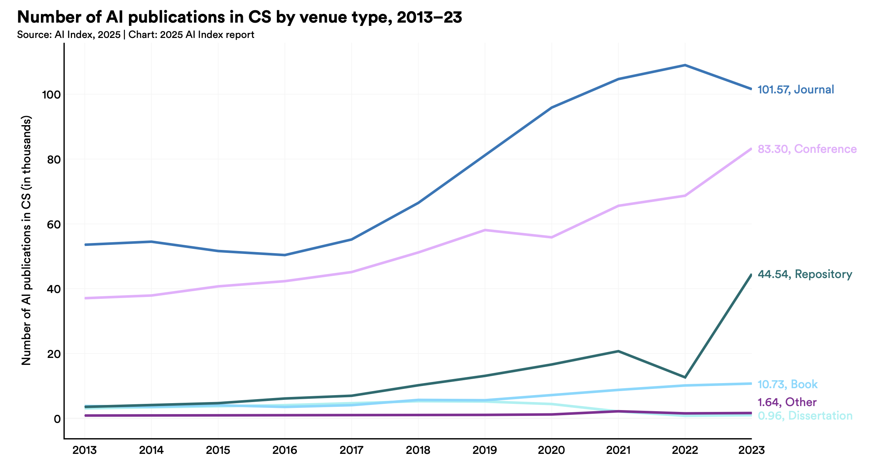

Title: Festina Lente - Make haste slowly while learning technology
Date: 2025-12-31 08:35
Slug: festina_lente
Status: published

The phrase *festina lente*—“make haste slowly”—was used by the Roman emperor Augustus as a personal motto. Suetonius reports that Augustus repeated it to his generals and administrators as a guiding principle: advance steadily, but never recklessly; act with urgency, but never without reflection. In that sense, the slogan is not about slowness at all, but about disciplined speed—progress that is fast precisely because it is anchored in care, preparation, and clear thinking.

> By Vicenç Valcárcel Pérez - Own work, CC BY-SA 4.0, https://commons.wikimedia.org/w/index.php?curid=99990278

For a software engineer constantly exposed to new tools, frameworks, and abstractions, **festina lente is a survival strategy**. The industry encourages you to chase every new shiny thing, but adopting technology too quickly can lead to attempting to keep up with the latest trends at the expense of feeling overwhelmed. Festina lente reminds you to **pause and reflect** before jumping on the next bandwagon. Take the time to evaluate whether a new technology truly fits your needs, aligns with your goals, and is worth the investment of learning and integration.

Once the decision to learn a new technology is made, festina lente encourages you to **approach the learning process with patience and care**. This means avoiding distractions from trying to learn too many things at once, and instead focusing on mastering one technology at a time. It also means being willing to invest the necessary time and effort to truly understand the technology, rather than rushing through tutorials or documentation.

## Turtle and sail

> Image by © Marie-Lan Nguyen / Wikimedia Commons, CC BY 2.5, https://commons.wikimedia.org/w/index.php?curid=21764505

The phrase *festina lente* is often associated with the image of a turtle carrying a sail. The turtle represents the slow and steady progress that comes from careful reflection and preparation, while the sail represents the speed and agility that comes from taking action with urgency. Together, they symbolize the balance between speed and caution that is at the heart of the festina lente philosophy.

**Steady progress**. The chart above is taken from [AI Index 2025 Annual Report](https://hai.stanford.edu/assets/files/hai_ai_index_report_2025.pdf) by Stanford University. It shows the number of AI-related publications per year. The trend is clear: the number of publications is growing steadily over time. This indicates that the field of AI is advancing at a steady pace, with new research and developments being published regularly.

The risk is that what we learnt just few years ago is becoming obsolete very quickly. I learnt organizing my learning over longer time horizons (approximately 3 to 6 months) to avoid being overwhelmed by the pace of change. I focus on mastering one technology at a time, and I avoid trying to learn too many things at once. I make sure I **consiously decide not to learn** or even explore some technologies that are trending but not relevant for my goals.

What I most care about is that the turtle 🐢 keeps moving forward steadily, even if slowly.
