Title: Fitness Functions for Data and AI: Computational Policies
Date: 2026-03-15 08:35
Slug: fitness_functions_data_mesh
Status: published

In *Building Evolutionary Architectures* and *Software Architecture: The Hard Parts*, Neal Ford and colleagues introduce the concept of **fitness functions** — automated checks that verify whether a system preserves its desired architectural characteristics over time. The idea is simple: if you care about a quality (latency, coupling, resilience), define an objective measure and automate its verification. Don't rely on manual reviews or good intentions.

Fitness functions can run automatically in your **CI/CD pipelines**, but they are not typical testing or static analysis tools. Unit tests verify that your code behaves correctly. SAT tools check for code smells or vulnerabilities. Fitness functions operate at a different level: they measure how well your system **fits the overall architecture design principles** adopted by your team or company. Is your service respecting the agreed coupling boundaries? Is your module's dependency graph consistent with the target architecture? These are the kind of questions fitness functions answer.

### Example: component size threshold

Let's make this concrete with an example from the book. Suppose your team has an architecture principle that **no single component should dominate the codebase**. You can encode this as a fitness function:

|  |  |
|---|---|
| **Fitness function** | No component shall exceed X% of the overall codebase |
| **Type** | Holistic, automated |
| **Trigger** | CI/CD pipeline on deployment |
| **What it checks** | The percentage of overall source code represented by each component |
| **Action** | Alerts the architect if any component exceeds the threshold |

For instance, imagine your application has 6 components and you set the threshold at 30%:

| Component | Codebase % | Status |
|---|---|---|
| Account | 18% | Pass |
| Ticketing | 15% | Pass |
| Purchases | 22% | Pass |
| Notifications | 8% | Pass |
| Reporting | **35%** | **Fail or Warning** |
| Auth | 2% | Pass |

The Reporting component has grown beyond the threshold. This doesn't necessarily mean something is broken — but it's a signal that this component may be accumulating too many responsibilities and should be reviewed by the architect.

The threshold depends on the size of the application. For a small application with 10 components, 30% might be a reasonable limit to catch outliers. For a large application with 50 components, 10% would be more appropriate. The point is not the exact number — it's that **the architectural principle is encoded as an automated, objective check** rather than left to someone's judgment during code review.

This is what makes fitness functions different from tests. A unit test would check that a function returns the right output. This fitness function checks that your system's structure still reflects the architecture your team agreed on.

## Data Mesh Computational Policies as Fitness Functions

My data engineering team at TeamSystem has been applying this same concept to **data mesh** — but instead of checking software architecture characteristics, we check **data product characteristics**. In data mesh terms, these are called **computational policies**.

### What are computational policies?

In *Data Mesh*, Zhamak Dehghani introduces computational policies as automated governance mechanisms. Each domain team owns its data products autonomously, but certain global guarantees must hold across the mesh — schema conventions, SLO adherence, discoverability metadata, interoperability contracts, access control rules. Rather than enforcing these through a central governance board or manual review, you encode them as automated checks that run continuously.

## The parallel with fitness functions

The overlap is tight. Replace "architecture characteristic" with "data product governance rule" and the pattern is the same.

Both fitness functions and computational policies share key properties:

- **Automated** — neither relies on humans reviewing things manually at scale
- **Objective and measurable** — they produce a pass/fail or a metric, not a subjective opinion
- **Guardrails, not gates** — the goal is to enable team autonomy while preventing drift from system-wide properties
- **Lifecycle-aware** — some run at build time (schema validation), some at deploy time (contract compatibility), some continuously at runtime (SLO monitoring)
- **Protect emergent properties** — individual teams making locally rational decisions can degrade global qualities like interoperability or discoverability, so you need automated checks at a higher level

## What changes is the scope

The main difference is one of scope and domain. Fitness functions in *The Hard Parts* focus on software architecture characteristics — coupling, cohesion, latency, scalability, resilience. Computational policies focus on data product characteristics — schema quality, freshness, discoverability, interoperability, compliance.

The underlying mechanism and philosophy are identical.

## Atomic vs holistic

The book categorizes fitness functions as **atomic** (checking a single property) or **holistic** (checking cross-cutting concerns). The same categorization applies to computational policies:

- **Atomic**: does this data product expose standard metadata? Does it meet its declared freshness SLO?
- **Holistic**: can a consumer actually discover, understand, and consume this product end-to-end?

Holistic policies are harder to implement but more valuable — they catch the gaps that atomic checks miss.

## Why this framing matters

If you come from a software architecture background and are entering the data mesh space, recognizing that computational policies are fitness functions gives you a familiar mental model. You already know the philosophy. You already understand why automation matters, why objectivity matters, why guardrails beat gates. And if you're already practicing data mesh governance, calling your policies "fitness functions" can help communicate their purpose to stakeholders who come from a software engineering background. It's a useful shared vocabulary.

But to me, there's a deeper reason why this framing matters. Guidelines can — and sometimes should — be ignored. Domain teams must be free to adopt their own design principles when their context demands it. The power of computational policies is that they **enable adoption** by teams while **enforcing or nudging** company-level principles through automation, not bureaucracy. Governance teams evolve from writing documents that nobody reads into **computational policy engineers** — people who encode organizational knowledge into automated, executable checks. That's a fundamentally different role, and a far more effective one.
