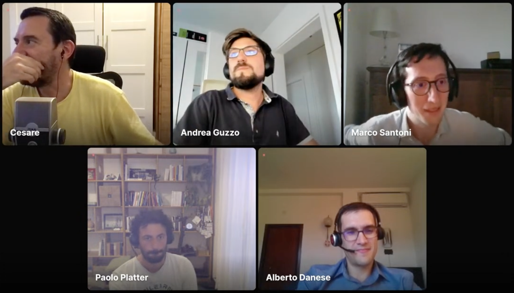
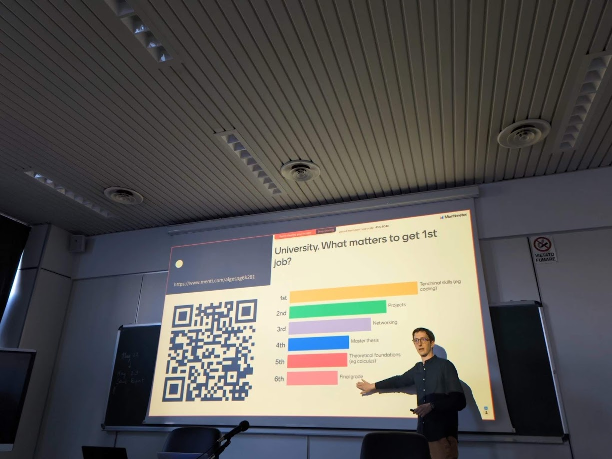

Title: about

I am passionate about data, AI and software engineering, and I am lucky to have turned them into my daily work. Always driven by curiosity and by an attitude for learning, I enjoy working both on the façade and on the foundations of a data product, ranging from machine learning to data engineering, devops, and data intensive architectures.

Feel free to get in touch via [LinkedIn](https://www.linkedin.com/in/msantoni/) 👇

<a class="LI-simple-link" href='https://it.linkedin.com/in/msantoni?trk=profile-badge'>Marco Santoni</a>

I co-host the [Intervista Pythonista](https://intervistapythonista.com/) podcast about the Python ecosystem. We run bi-weekly interviews to Pythonistas in the Italian community about backend development, data science, automation and scientific research.

I also enjoy [training]({filename}/pages/training.md) as a side activity: I design and deliver technical courses on data engineering and related topics.
