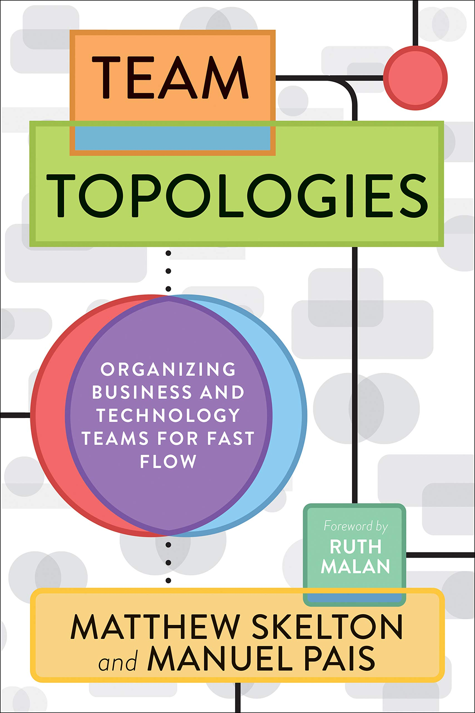

Title: bookshelf

As I mostly read e-books, I don't have a physical bookshelf at home. I decided to build a digital bookshelf here to keep track of what I'm reading over the years (novels are not listed here). I won't write reviews here, but I'll just place  a "**♥**" next to the books definitely worth reading.

|   |   |
|---|---|
|  |   |
|   |  Essentialism: the Disciplined Pursuit of Less |
|  |   |
|  **♥** Team Topologies |  **♥** Agile Estimating and Planning |
|   |   |
|  Mythical Man-Month  |  The Black Swan: The Impact of the Highly Improbable |
|   |   |
|  Designing data-intensive applications  |  **♥** The Phoenix Project |
|   |   |
| **♥** Thinking, Fast and Slow  |  Deep Learning |
|   |   |
| The Docker Book: Containerization is the new virtualization  |  Python Deep Learning: Next generation techniques to revolutionize computer vision, AI, speech and data analysis |
|   |   |
| **♥** Pragmatic Programmer, The: From Journeyman to Master  |  **♥** The Signal and the Noise: The Art and Science of Prediction |
|   |   |
| The Art of R Programming: A Tour of Statistical Software Design  |  Why: A Guide to Finding and Using Causes |
|   |   |
| **♥** Bayesian Methods for Hackers: Probabilistic Programming and Bayesian Inference  | Python for Data Analysis: Data Wrangling with Pandas, NumPy, and IPython  |
|   |   |
| Speech and Language Processing  |  Computer Networking: A Top-Down Approach |
