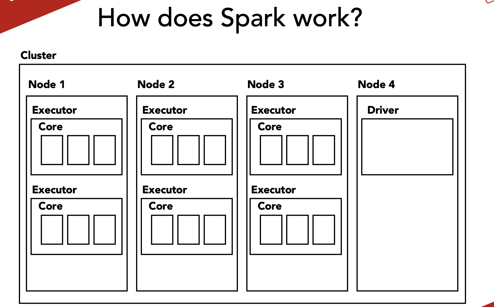
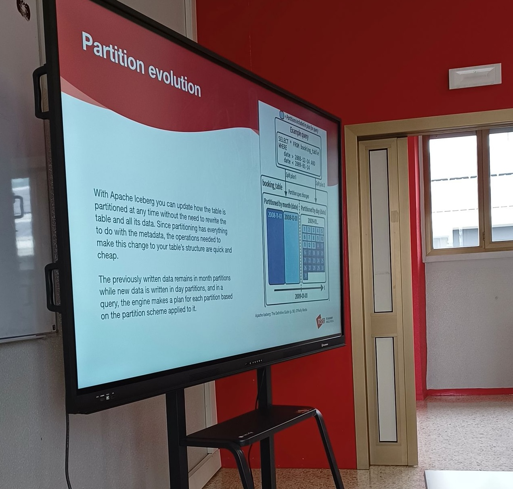

Title: training

I design and deliver technical courses for professional audiences and technical schools. Here are the trainings I have lectured so far.

---

### Apache Spark for Data Analysis

A hands-on course delivered at [ITS Rizzoli](https://www.itsrizzoli.it/en/home-en/) in Milan (2022 and 2023). The course spanned 44 hours over 11 lessons, covering the fundamentals of Apache Spark with a strong focus on live coding and practical exercises. Students worked on a Databricks environment, learning how to build batch and streaming data transformations with PySpark.

---

### Data lake and table formats - Apache Iceberg

A comprehensive course on modern data lake architectures and Apache Iceberg table formats delivered at ITS Rizzoli in Milan (2024). Participants learn how to design scalable data lakes, understand the benefits of open table formats, and implement Iceberg for improved data reliability, schema evolution, and time-travel capabilities. The course combines theoretical concepts with practical examples, covering real-world use cases in data warehousing and analytics.

---

### AI Agents for Data and Analytics Engineering

🚧 Coming autumn 2026
